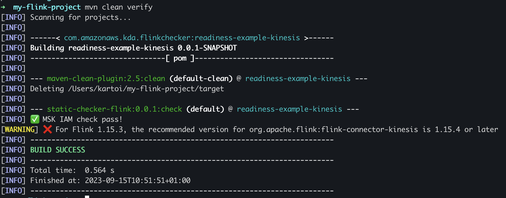
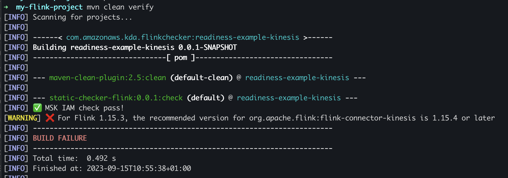

### Why this project exists

The goal of this project is to catch certain issues with Apache Flink applications fast (during build/packaging).

Covered cases:

- Kinesis connector compatibility issues
- Kafka connector compatibility issues
- MSK IAM Auth library issues

For instance did you know that you have to use AWS Kinesis Connector 1.15.4 or above for Flink 1.15 apps? This plugin
is there to stop you from building an app that has such incompatible connector versions.

## What this project is

Maven plugin to find issues with Apache Flink applications at build time.

### Example usage:

Run the following Maven command in your Maven (Apache Flink) project dir:

```
mvn software.amazon.kinesis:static-checker-flink:0.0.1:check
```

Checker results should also appear in `target/` folder in jUnit format, so you can integrate it with a CI tool.

### How to include it in project pom.xml so it runs on every build

Include plugin in `pom.xml`
```
<build>
    <plugins>
        <plugin>
            <groupId>software.amazon.kinesis</groupId>
            <artifactId>static-checker-flink</artifactId>
            <version>0.0.1</version>
            <executions>
                <execution>
                    <goals>
                        <goal>check</goal>
                    </goals>
                </execution>
            </executions>
        </plugin>
    </plugins>
</build>
```

Verify project
```
mvn clean verify
```

You should get a warning about issues in your project:



If you want to fail the build because of the detected issues, enable strict mode:

```
<build>
    <plugins>
        <plugin>
            <groupId>software.amazon.kinesis</groupId>
            <artifactId>static-checker-flink</artifactId>
            <version>0.0.1</version>
            <executions>
                <execution>
                    <goals>
                        <goal>check</goal>
                    </goals>
		    <configuration>
			<mode>STRICT</mode>
		    </configuration>
                </execution>
            </executions>
        </plugin>
    </plugins>
</build>
```

The output should looks as follows:



### Note on keeping the plugin up to date

Please use the most up to date version of the plugin as more known issues are contributed by the community.

There are tools such as Dependabot to automate this.

## Contributing

Contributing is very easy and is more than welcome!

1) Fork the project
2) Write your code in a branch in your fork
3) Push your branch upstream, GitHub will show you a button to create a Pull Request (PR)

Contributing is not limited to writing code, you can also contribute by creating issues or giving us feedback for instance. 

## Security

See [CONTRIBUTING](CONTRIBUTING.md#security-issue-notifications) for more information.

## License

This project is licensed under the Apache-2.0 License.

